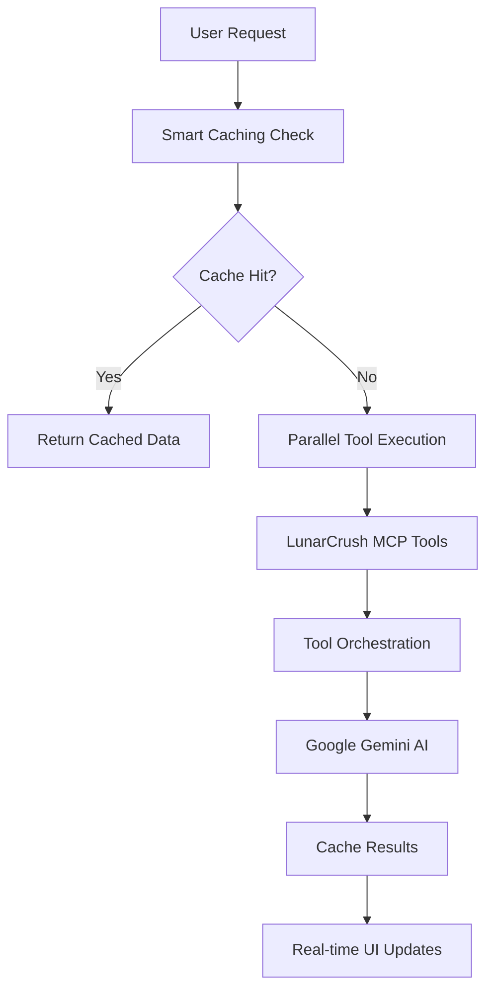

# 🌙 LunarCrush MCP Trading Terminal

> **Intelligent crypto trading terminal powered by LunarCrush social intelligence and Google Gemini AI**

[](https://nextjs.org/)
[](https://www.typescriptlang.org/)
[](https://remix.run/)
[](https://lunarcrush.com/)
[](https://ai.google.dev/)


## 🎯 What This Does

This **LunarCrush MCP Trading Terminal** provides intelligent cryptocurrency trading analysis by combining **real-time social sentiment data** from LunarCrush's Model Context Protocol (MCP) server with **Google Gemini AI** for sophisticated market analysis. Watch as it processes social intelligence through an **advanced tool orchestration system** with smart caching and real-time progress tracking.

### ⚡ **Key Features**

- 🧠 **AI-Powered Analysis** - Google Gemini generates intelligent trading signals with confidence scores
- 📊 **MCP Tool Orchestration** - Parallel execution of LunarCrush tools for maximum performance
- 🚀 **Smart Caching System** - Pre-cached tool orchestration for popular coins with 10-minute TTL
- 📱 **Real-Time Progress** - Live progress tracking with meaningful step indicators
- 🎨 **Modern UI/UX** - Professional glass morphism design with responsive animations
- ⚡ **High Performance** - Optimized for speed with parallel processing and intelligent caching
- 🔧 **Developer-Friendly** - Comprehensive error handling and TypeScript throughout

---

## 🚀 Quick Start (5 Minutes)

**For experienced developers who want to get running fast:**

```bash
# 1. Clone and install
git clone https://github.com/yourusername/lunarcrush-mcp-terminal.git
cd lunarcrush-mcp-terminal
npm install

# 2. Copy environment template
cp .env.example .env.local

# 3. Add your API keys (see detailed setup below)
# Edit .env.local with your required API keys

# 4. Start development
npm run dev          # Terminal app (localhost:3000/trading)
```

**🎯 Need the detailed setup?** Continue reading for step-by-step instructions with account creation guides.

---

## � Prerequisites

**You'll Need:**
- Node.js 18+ installed
- Basic knowledge of React/TypeScript
- A code editor (VS Code recommended)
- 15 minutes for complete setup

**2 API Keys Required:**
1. 🌙 **LunarCrush API** - Social intelligence data
2. 🤖 **Google Gemini API** - AI analysis (free tier available)

---

## 🔧 Detailed Setup Guide

### Step 1: Project Installation

```bash
# Clone the repository
git clone https://github.com/yourusername/lunarcrush-mcp-terminal.git
cd lunarcrush-mcp-terminal

# Install dependencies
npm install

# Create environment file
cp .env.example .env.local
```

### Step 2: LunarCrush API Setup 🌙

LunarCrush provides real-time social sentiment data through their MCP server with unique metrics.

1. **Sign up**: Visit [lunarcrush.com/signup](https://lunarcrush.com/signup)
2. **Choose a plan**:
   - **Individual** - Perfect for this project
   - **Builder** - For production apps
3. **[Generate API key](https://lunarcrush.com/developers/api/authentication)**
4. **Add to .env.local**:

```env
LUNARCRUSH_API_KEY=your_api_key_here
```

**💡 Why LunarCrush MCP?** Provides structured social intelligence through Model Context Protocol:
- **Social mentions** and engagement metrics
- **Influencer tracking** and impact analysis
- **Community sentiment** and growth trends
- **Real-time alerts** and market signals

### Step 3: Google Gemini AI Setup 🤖

Google's Gemini AI generates intelligent trading recommendations based on social patterns.

1. **Get API key**: Visit [aistudio.google.com](https://aistudio.google.com/)
2. **Create new project** or use existing one
3. **Generate API key**: API Keys → Create API Key
4. **Add to .env.local**:

```env
GEMINI_API_KEY=your_gemini_api_key_here
```

**💡 Why Gemini?** Excellent reasoning capabilities for financial analysis and trading signal generation with structured outputs.

### Step 4: Final Environment Check ✅

Your `.env.local` should look like this:

```env
# LunarCrush API (Required)
LUNARCRUSH_API_KEY=your_api_key_here

# Google Gemini AI (Required)
GEMINI_API_KEY=your_gemini_api_key_here
```

---

## 🚀 Running the Application

### Development Mode

```bash
npm run dev
```
→ Visit [http://localhost:3000/trading](http://localhost:3000/trading)

### Testing the Complete Pipeline

1. **Open the terminal**: [http://localhost:3000/trading](http://localhost:3000/trading)
2. **Select a cryptocurrency** or use quick select buttons
3. **Click "Analyze"** to start the AI analysis
4. **Watch real-time progress**: 8-step analysis with smart caching indicators
5. **View results**: Trading signals with confidence scores and detailed reasoning

**Expected Flow:**
```
🔗 Connect to LunarCrush (12%) →
📊 Tool Orchestration (24%) →
⚡ Process Social Data (36%) →
🧠 AI Analysis (48%) →
📈 Pattern Recognition (60%) →
💡 Generate Insights (72%) →
🎯 Recommendation (84%) →
✅ Complete (100%)
```

---

## 🏗️ Architecture Overview

### Technology Stack

| Component           | Technology                         | Purpose                                       |
| ------------------- | ---------------------------------- | --------------------------------------------- |
| **Frontend**        | Remix + React 18 + TypeScript     | Modern web application with server components |
| **Styling**         | Tailwind CSS + HeroUI             | Responsive, professional UI                   |
| **AI Analysis**     | Google Gemini                      | Trading signal generation                     |
| **Social Data**     | LunarCrush MCP                     | Crypto sentiment analysis with tool orchestration |
| **Caching**         | In-memory + TTL                    | Performance optimization for tool orchestration |
| **State Management** | React Hooks                       | Client-side state and real-time updates      |

### MCP Tool Orchestration Flow



### Key Files Structure

```
app/
├── routes/
│   ├── trading._index.tsx          # Main trading terminal with tool orchestration
│   └── api/
│       └── analyze.ts               # Analysis API with caching
├── services/
│   ├── gemini-ai.ts                # Google Gemini AI integration
│   ├── lunarcrush.ts               # LunarCrush MCP client
│   └── preCacheTools.js            # Caching and pre-caching logic
├── components/
│   ├── PriceChart.tsx              # Cryptocurrency price charts
│   └── CryptoChart.tsx             # Advanced chart components
├── hooks/
│   └── useMcpServer.js             # MCP server integration hook
├── types/
│   └── index.ts                    # TypeScript interfaces
└── config/
    └── site.ts                     # Site configuration
```

---

## 🧪 Testing & Debugging

### Development Tools

The application includes comprehensive debugging capabilities:
- ✅ **Real-time progress tracking** - Monitor each analysis step
- 📊 **Cache status indicators** - See when cached data is used
- 🐛 **Error handling** - Graceful failure with detailed error messages
- ⏱️ **Performance metrics** - Track analysis duration and caching efficiency

### Testing the Pipeline

```bash
# Test the complete analysis flow
curl -X POST http://localhost:3000/api/analyze \
  -H "Content-Type: application/json" \
  -d '{"symbol": "BTC"}'

# Check cache status
# Watch browser console for cache hit/miss indicators
```

---

## 🚨 Troubleshooting

### Common Issues & Solutions

| Issue                                | Symptoms                                      | Solution                                                                                        |
| ------------------------------------ | --------------------------------------------- | ----------------------------------------------------------------------------------------------- |
| **Environment Variables Missing**    | "API key not found" errors                   | Check `.env.local` file exists and contains both required API keys                              |
| **LunarCrush 401 Unauthorized**      | "Invalid API key" error                       | Verify API key format and active subscription at lunarcrush.com                                |
| **Gemini AI Errors**                 | "AI analysis failed"                          | Check Google AI API key and quota limits at aistudio.google.com                                |
| **Caching Issues**                   | Slow performance or stale data                | Restart development server or check cache TTL settings                                         |
| **MCP Tool Orchestration Failures**  | Incomplete analysis or missing data           | Verify LunarCrush API key and check network connectivity                                       |

### Debug Workflow

**If the app isn't working:**

1. ✅ **Check environment variables**: Both API keys in `.env.local`
2. ✅ **Verify API subscriptions**: LunarCrush plan active, Gemini quota available
3. ✅ **Check browser console**: Look for JavaScript errors or network failures
4. ✅ **Test individual APIs**: Use curl or Postman to test API endpoints directly
5. ✅ **Clear cache**: Restart development server to clear any cached data
6. ✅ **Check network**: Ensure internet connectivity for API calls

### API Rate Limits

**LunarCrush API Limits:**
- **Individual Plan**: 10 requests/minute, 2,000/day
- **Builder Plan**: 100 requests/minute, 20,000/day

**Google Gemini Limits:**
- **Free Tier**: 15 requests/minute, 1,500/day
- **Paid Tier**: 1,000 requests/minute

**If you hit limits:**
- Analysis will fail gracefully with error messages
- Upgrade your plan for higher limits
- The system includes intelligent caching to minimize API calls

---

## 🚀 Deployment

### Deploy to Vercel (Recommended)

**One-Click Deploy:**
[](https://vercel.com/new/clone?repository-url=https://github.com/yourusername/lunarcrush-mcp-terminal)

**Manual Deployment:**

```bash
# Install Vercel CLI
npm i -g vercel

# Deploy to production
vercel --prod

# Configure environment variables in Vercel dashboard
# Add both API keys from your .env.local
```

**Environment Variables in Vercel:**
1. Go to your project dashboard → Settings → Environment Variables
2. Add each variable from your `.env.local`:
   - `LUNARCRUSH_API_KEY`
   - `GEMINI_API_KEY`

### Production Configuration

**Performance Optimizations:**
- **Caching**: Production-ready caching with appropriate TTL
- **Error Handling**: Comprehensive error boundaries and graceful degradation
- **Rate Limiting**: Built-in protection against API quota exhaustion
- **Monitoring**: Structured logging for production debugging

### Alternative Deployment Platforms

- **Netlify**: `npm run build && netlify deploy --prod`
- **Railway**: Connect GitHub repo and configure environment variables
- **DigitalOcean**: App Platform deployment with environment variables

---

## 📈 Performance & Scaling

### Current Performance

- **Initial load**: ~300ms (optimized Remix with SSR)
- **Analysis completion**: ~15-30 seconds with caching
- **Tool orchestration**: Parallel execution for maximum efficiency
- **Cache efficiency**: 10-minute TTL for popular coins

### Scaling Considerations

**For high-volume usage:**

- **LunarCrush API**: Upgrade to Builder plan for higher limits
- **Caching**: Implement Redis or similar for distributed caching
- **AI processing**: Batch requests and implement response caching
- **Load balancing**: Use CDN and edge caching for static assets

**Performance Optimizations Included:**
- **Smart caching**: Pre-cached tool orchestration for popular coins
- **Parallel processing**: Simultaneous tool execution where possible
- **Efficient UI updates**: Minimal re-renders with optimized state management
- **Error boundaries**: Graceful degradation without full page reloads

---

## 🤝 Contributing

**Want to contribute? Here's how:**

1. 🍴 **Fork the repository**
2. 🌿 **Create feature branch**: `git checkout -b feature/amazing-feature`
3. 💾 **Commit changes**: `git commit -m 'Add amazing feature'`
4. 📤 **Push to branch**: `git push origin feature/amazing-feature`
5. 🎯 **Open Pull Request**

**Contribution Ideas:**
- 🤖 Support for other AI providers (Claude, OpenAI)
- 📈 Advanced chart visualizations and technical indicators
- 🧪 Comprehensive test suite with integration tests
- 📱 Mobile-optimized responsive design improvements
- 🔄 Real-time data streaming and WebSocket integration

**Development Guidelines:**
- Follow TypeScript strict mode
- Add tests for new features
- Update documentation
- Maintain performance standards
- Use ESLint and Prettier for code formatting

---

## 📄 License

This project is licensed under the MIT License - see the [LICENSE](LICENSE) file for details.

---

## 🙏 Acknowledgments

**Built with amazing open-source technologies:**

- 🌙 **[LunarCrush](https://lunarcrush.com/)** - Real-time social intelligence data with MCP support
- 🤖 **[Google AI](https://ai.google.dev/)** - Gemini AI for intelligent trading analysis
- ⚛️ **[Remix](https://remix.run/)** - Full-stack web framework with excellent performance
- 🎨 **[Tailwind CSS](https://tailwindcss.com/)** - Utility-first CSS framework
- 🔧 **[HeroUI](https://heroui.com/)** - Beautiful React components with accessibility
- 📊 **[MCP](https://modelcontextprotocol.io/)** - Model Context Protocol for structured AI interactions

---

## 📞 Connect & Support

**Built by [Your Name](https://your-portfolio.com/)**

[](https://your-portfolio.com/)
[](https://linkedin.com/in/yourprofile)
[](https://github.com/yourusername)

**⭐ Star this repo** if it helped you learn something new!

**Questions?** Open an [issue](https://github.com/yourusername/lunarcrush-mcp-terminal/issues) - I respond to every one!

---

## 🚀 Ready to Get Started?

1. **🔥 [Clone the Repository](https://github.com/yourusername/lunarcrush-mcp-terminal)**
2. **📚 [Follow the Setup Guide](#-detailed-setup-guide)**
3. **🚀 [Deploy to Production](#-deployment)**
4. **💬 [Join the Discussion](https://github.com/yourusername/lunarcrush-mcp-terminal/discussions)**

---

*"Transform social intelligence into trading insights with AI-powered analysis"* 🌙🤖

**Built for developers who want to:**
- ✅ **Learn modern MCP integration patterns**
- ✅ **Build production-ready trading applications**
- ✅ **Understand AI tool orchestration**
- ✅ **Create impressive portfolio projects**
- ✅ **Master advanced caching strategies**

**Start building your MCP-powered trading terminal today!** 🚀

---

## 🔗 Resources

- **[LunarCrush MCP Documentation](https://lunarcrush.com/developers/mcp)**
- **[Google Gemini AI Documentation](https://ai.google.dev/docs)**
- **[Remix Documentation](https://remix.run/docs)**
- **[Model Context Protocol](https://modelcontextprotocol.io/docs)**
- **[Tailwind CSS Documentation](https://tailwindcss.com/docs)**

---

🌙 **LunarCrush MCP** • 🤖 **Google Gemini AI** • ⚛️ **Remix** • 🎨 **Tailwind CSS**
```bash
npm install
# or
yarn install
```

3. **Environment Setup**
Create a `.env.local` file in the root directory:
```env
LUNARCRUSH_API_KEY=your_lunarcrush_api_key_here
GEMINI_API_KEY=your_gemini_api_key_here
```

4. **Start the development server**
```bash
npm run dev
# or
yarn dev
```

5. **Open your browser**
Navigate to `http://localhost:5173/trading`

## 🔧 Configuration

### API Keys Setup

#### LunarCrush API Key
1. Visit [LunarCrush](https://lunarcrush.com/)
2. Sign up for a free account
3. Navigate to API section
4. Generate your API key
5. Add to `.env.local` as `LUNARCRUSH_API_KEY`

#### Google Gemini API Key
1. Visit [Google AI Studio](https://ai.google.dev/)
2. Sign up and create a new project
3. Generate an API key
4. Add to `.env.local` as `GEMINI_API_KEY`

## 📁 Project Structure

```
lunarcrush-ai-terminal/
├── app/
│   ├── routes/
│   │   ├── trading._index.tsx      # Main trading terminal
│   │   └── api/
│   │       └── analyze.ts          # API endpoint for analysis
│   ├── services/
│   │   ├── gemini-ai.ts           # Gemini AI integration
│   │   └── lunarcrush.ts          # LunarCrush API client
│   ├── layout.tsx                 # App layout
│   └── globals.css               # Global styles
├── components/
│   └── PriceChart.tsx            # Cryptocurrency price charts
├── public/                       # Static assets
├── types/                        # TypeScript type definitions
└── config/                       # Configuration files
```

## 🎯 Usage

### Basic Analysis
1. **Enter a cryptocurrency symbol** (BTC, ETH, SOL, etc.)
2. **Click "Analyze"** to start the AI analysis
3. **Watch the progress** through 8 detailed steps
4. **Review results** including recommendation, confidence, and reasoning

### Progress Steps
The analysis goes through 8 detailed steps:

1. **🔗 Connect** - Connecting to LunarCrush MCP (12%)
2. **📊 Fetch Data** - Fetching social & market data (24%)
3. **⚡ Process** - Processing social metrics (36%)
4. **🧠 AI Analysis** - Running Gemini AI analysis (48%)
5. **📈 Patterns** - Analyzing market patterns (60%)
6. **💡 Insights** - Generating insights (72%)
7. **🎯 Recommend** - Finalizing recommendations (84%)
8. **✅ Complete** - Preparing results (95% → 100%)

### Advanced Features
- **Quick Select**: Click preset coins (BTC, ETH, SOL, ADA, DOGE)
- **Dynamic Messages**: Watch real-time AI processing updates
- **Confidence Scores**: Get percentage-based recommendation confidence
- **Detailed Reasoning**: Understand the AI's decision-making process

## 🔌 API Integration

### LunarCrush MCP Integration
```typescript
// Example: Fetching social sentiment data
const socialData = await lunarCrushClient.getSocialMetrics(symbol);
```

### Google Gemini AI Integration
```typescript
// Example: Getting AI analysis
const analysis = await geminiClient.analyzeMarket({
  symbol,
  socialData,
  marketData
});
```

## 🎨 Customization

### Styling
- Built with **Tailwind CSS** and **HeroUI**
- Easy theme customization in `tailwind.config.ts`
- Glass morphism effects with backdrop blur
- Responsive design with mobile-first approach

### Progress Messages
Customize AI analysis messages in `trading._index.tsx`:
```typescript
const aiAnalysisMessages = [
  "Your custom message...",
  "Another processing step...",
  // Add more messages
];
```

## 🚀 Deployment

### Vercel (Recommended)
1. **Connect your GitHub repo** to Vercel
2. **Set environment variables** in Vercel dashboard
3. **Deploy automatically** on push to main branch

### Other Platforms
- **Netlify**: Full support for Remix apps
- **Railway**: Easy deployment with environment variables
- **DigitalOcean**: App Platform deployment
- **Self-hosted**: Use `npm run build` and serve the `build` folder

## 🤝 Contributing

1. **Fork the repository**
2. **Create a feature branch**: `git checkout -b feature/amazing-feature`
3. **Commit your changes**: `git commit -m 'Add amazing feature'`
4. **Push to the branch**: `git push origin feature/amazing-feature`
5. **Open a Pull Request**

### Development Guidelines
- Follow **TypeScript** best practices
- Use **ESLint** and **Prettier** for code formatting
- **Write meaningful commit messages**
- Test thoroughly before submitting PRs

## 📋 Requirements

### System Requirements
- **Node.js** 18.0.0 or higher
- **npm** 8.0.0 or higher (or yarn equivalent)
- **Modern browser** with ES2020 support

### Dependencies
- **@remix-run/react**: ^2.15.1
- **@heroui/system**: ^2.4.17  
- **react**: 18.3.1
- **tailwindcss**: Latest
- **typescript**: Latest

## 🐛 Troubleshooting

### Common Issues

#### API Key Errors
```
Error: Invalid API key
```
**Solution**: Verify your API keys in `.env.local` are correct and active

#### Build Errors
```
Module not found
```
**Solution**: Run `npm install` to ensure all dependencies are installed

#### Port Already in Use
```
Port 5173 is already in use
```
**Solution**: Kill the process or use a different port: `npm run dev -- --port 3000`

### Getting Help
- **GitHub Issues**: Report bugs and request features
- **Discussions**: Ask questions and share ideas
- **Discord**: Join our community for real-time help

## 📄 License

This project is licensed under the **MIT License** - see the [LICENSE](LICENSE) file for details.

## 🙏 Acknowledgments

- **[LunarCrush](https://lunarcrush.com/)** - Social intelligence data
- **[Google Gemini](https://ai.google.dev/)** - AI analysis capabilities  
- **[Remix](https://remix.run/)** - Full-stack web framework
- **[HeroUI](https://heroui.com/)** - Beautiful React components
- **[Tailwind CSS](https://tailwindcss.com/)** - Utility-first CSS framework

## 🔗 Links

- **[Live Demo](https://your-demo-url.vercel.app)**
- **[Documentation](https://your-docs-url.com)**
- **[LunarCrush API Docs](https://lunarcrush.com/developers)**
- **[Gemini AI Docs](https://ai.google.dev/docs)**
- **[MCP Documentation](https://modelcontextprotocol.io/docs)**

---

⭐ **Star this repo** if you found it helpful!

Built with ❤️ using LunarCrush MCP, Google Gemini AI, and Remix
